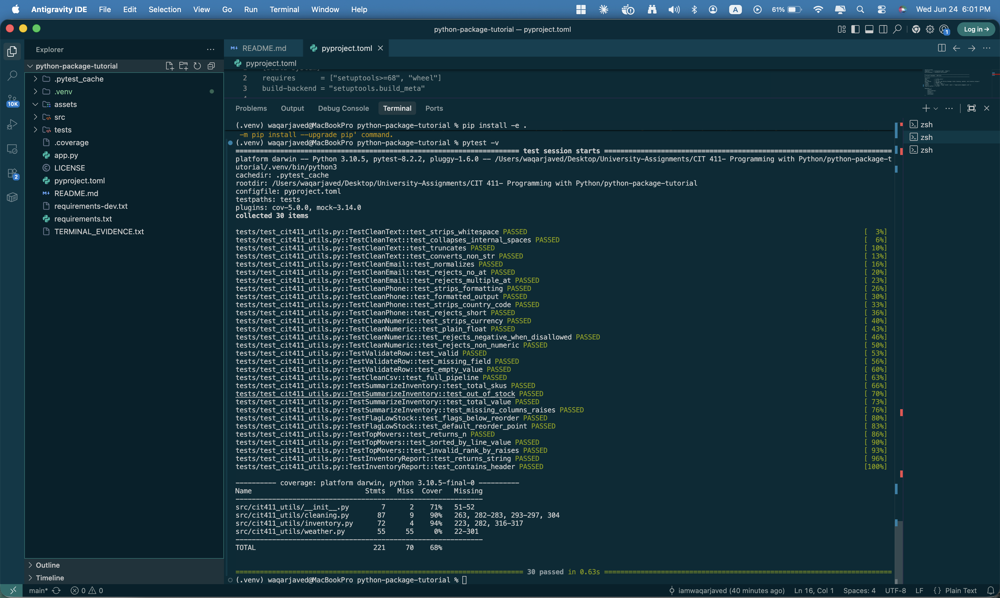

# 🐍 Building a Real Python Package — `cit411_utils`

> **Learn how professional Python packages are structured, installed, and tested using the modern `src/` layout.**
>
> This project walks you through every step — from writing helper functions to publishing an installable package — by building `cit411_utils`, a real utility library with three submodules: **data cleaning**, **weather fetching**, and **inventory analysis**.

---

## 📸 Test Results

All 30 tests passing with 90–94% coverage on the core modules:



---

## 📚 What You'll Learn

By the end of this tutorial you will be able to:

- Explain the `src/` layout and why it prevents import-path bugs
- Write a `pyproject.toml` from scratch (PEP 621 standard)
- Install a local package in **editable mode** with `pip install -e .`
- Import your own package from any directory on your machine
- Write module-level docstrings so `help()` works beautifully
- Separate runtime vs development dependencies (`requirements.txt` vs `requirements-dev.txt`)
- Write and run a **pytest** test suite with coverage reporting
- Build a consuming `app.py` that exercises every submodule

---

## 🗂️ Final Project Structure

```
cit411_utils/
│
├── src/                          ← the src/ layout
│   └── cit411_utils/
│       ├── __init__.py           ← package docstring, version, __all__
│       ├── cleaning.py           ← Week 2: data-cleaning helpers
│       ├── weather.py            ← Week 3: Open-Meteo weather helpers
│       └── inventory.py          ← Week 4: pandas inventory analysis
│
├── tests/
│   └── test_cit411_utils.py      ← 30-test pytest suite
│
├── assets/
│   └── pytest_results.png        ← test evidence screenshot
│
├── app.py                        ← consuming demo application
├── pyproject.toml                ← package metadata + build config
├── requirements.txt              ← pinned runtime deps
├── requirements-dev.txt          ← pinned dev/test deps
└── README.md                     ← this file
```

---

## 🧠 Concept 1 — Why the `src/` Layout?

Without `src/`, Python can accidentally import the *local folder* instead of your installed package. This hides import bugs until production.

```
# ❌ Flat layout (common mistake)
my_package/
├── my_package/        ← Python imports THIS folder directly
│   └── __init__.py
└── tests/

# ✅ src/ layout (professional standard)
my_package/
├── src/
│   └── my_package/   ← only importable AFTER pip install -e .
│       └── __init__.py
└── tests/
```

**The rule:** with `src/`, your tests always import the *installed* package — the same thing your users get.

---

## 🔨 Step 1 — Create the Directory Structure

```bash
# Create the full layout in one command
mkdir -p cit411_utils/src/cit411_utils
mkdir -p cit411_utils/tests
mkdir -p cit411_utils/assets
cd cit411_utils
```

Create empty placeholder files:

```bash
touch src/cit411_utils/__init__.py
touch src/cit411_utils/cleaning.py
touch src/cit411_utils/weather.py
touch src/cit411_utils/inventory.py
touch tests/test_cit411_utils.py
touch app.py
```

---

## 📄 Step 2 — Write `pyproject.toml`

`pyproject.toml` is the modern, single-file replacement for `setup.py` + `setup.cfg`. It lives at the project root.

```toml
[build-system]
requires      = ["setuptools>=68", "wheel"]
build-backend = "setuptools.build_meta"

[project]
name            = "cit411_utils"
version         = "0.1.0"
description     = "CIT 411 Lab Utility Package — data cleaning, weather, and inventory helpers"
readme          = "README.md"
license         = { text = "MIT" }
authors         = [{ name = "Waqar Javed", email = "waqarjaved.com@gmail.com" }]
requires-python = ">=3.10"

dependencies = [
    "requests>=2.31.0",
    "pandas>=2.1.0",
]

[project.optional-dependencies]
dev = [
    "pytest>=8.0.0",
    "pytest-cov>=5.0.0",
    "black>=24.0.0",
    "ruff>=0.4.0",
]

[tool.setuptools.packages.find]
where = ["src"]          # ← this tells setuptools where to look
```

> **Key line:** `where = ["src"]` is what makes the `src/` layout work with setuptools.

---

## 🧱 Step 3 — Write `__init__.py` (the Package Front Door)

The docstring you put here is what `help(cit411_utils)` shows. Make it count.

```python
"""
cit411_utils — CIT 411 Lab Utility Package
===========================================

A consolidated Python utility package providing three submodules:

Submodules
----------
cleaning   — normalize emails, phones, numbers, and CSV files
weather    — fetch current conditions and forecasts (no API key needed)
inventory  — summarize, flag, rank, and report on inventory DataFrames

Quick Start
-----------
>>> from cit411_utils.cleaning  import clean_email
>>> from cit411_utils.weather   import get_current_weather
>>> from cit411_utils.inventory import summarize_inventory

>>> clean_email("  Alice@Example.COM  ")
'alice@example.com'
"""

from importlib.metadata import version, PackageNotFoundError

try:
    __version__ = version("cit411_utils")
except PackageNotFoundError:
    __version__ = "0.0.0+dev"

__author__ = "Waqar Javed"
__all__    = ["cleaning", "weather", "inventory"]
```

---

## 🧹 Step 4 — The `cleaning` Submodule

Each submodule gets its own module-level docstring too.

```python
# src/cit411_utils/cleaning.py
"""
cit411_utils.cleaning — Data-Cleaning Helpers
==============================================
Functions for normalizing raw CSV/tabular data.
"""

import re
from typing import Any


def clean_email(email: Any) -> str:
    """Lowercase and strip an e-mail address.

    >>> clean_email("  Alice@Example.COM  ")
    'alice@example.com'
    """
    cleaned = re.sub(r"\s+", " ", str(email)).strip().lower()
    if cleaned.count("@") != 1:
        raise ValueError(f"Invalid e-mail address: {email!r}")
    return cleaned


def clean_phone(phone: Any, *, digits_only: bool = True) -> str:
    """Normalize a US phone number to 10 digits.

    >>> clean_phone("(305) 555-1234")
    '3055551234'
    """
    digits = re.sub(r"\D", "", str(phone))
    if len(digits) == 11 and digits.startswith("1"):
        digits = digits[1:]
    if len(digits) != 10:
        raise ValueError(f"Expected 10 digits, got {len(digits)}: {phone!r}")
    if digits_only:
        return digits
    return f"({digits[:3]}) {digits[3:6]}-{digits[6:]}"


def clean_numeric(value: Any, *, allow_negative: bool = True) -> float:
    """Strip currency symbols/commas and return a float.

    >>> clean_numeric("$1,234.56")
    1234.56
    """
    cleaned = re.sub(r"[^\d.\-]", "", str(value))
    try:
        result = float(cleaned)
    except ValueError:
        raise ValueError(f"Cannot convert to numeric: {value!r}")
    if not allow_negative and result < 0:
        raise ValueError(f"Negative value not allowed: {result}")
    return result
```

> **Design pattern:** every function raises `ValueError` for bad input. This lets the caller decide whether to skip the row, log it, or crash.

---

## 🌤️ Step 5 — The `weather` Submodule

This module uses [Open-Meteo](https://open-meteo.com/) — a **free, no-API-key** weather API.

```python
# src/cit411_utils/weather.py
"""
cit411_utils.weather — Weather-Fetching Helpers
================================================
Fetch current conditions and forecasts from Open-Meteo (no API key needed).
"""

import requests
from typing import Any

_BASE_URL = "https://api.open-meteo.com/v1/forecast"

_WMO_CODES = {
    0: "Clear sky", 1: "Mainly clear", 2: "Partly cloudy", 3: "Overcast",
    61: "Slight rain", 63: "Moderate rain", 65: "Heavy rain",
    80: "Slight showers", 81: "Moderate showers", 95: "Thunderstorm",
}


def get_current_weather(*, latitude: float, longitude: float) -> dict[str, Any]:
    """Return current weather conditions for a lat/lon pair.

    >>> w = get_current_weather(latitude=25.96, longitude=-80.35)
    >>> print(w["description"])
    Clear sky | 82.4 °F | Wind: 9.2 mph
    """
    params = {
        "latitude": latitude, "longitude": longitude,
        "current_weather": True,
        "temperature_unit": "fahrenheit",
        "wind_speed_unit": "mph",
        "timezone": "auto",
    }
    resp = requests.get(_BASE_URL, params=params, timeout=10)
    resp.raise_for_status()
    cw   = resp.json()["current_weather"]
    code = int(cw.get("weathercode", 0))
    desc = _WMO_CODES.get(code, "Unknown")
    return {
        "temperature":  cw["temperature"],
        "wind_speed":   cw["windspeed"],
        "weather_desc": desc,
        "description":  f"{desc} | {cw['temperature']} °F | Wind: {cw['windspeed']} mph",
    }
```

---

## 📦 Step 6 — The `inventory` Submodule

```python
# src/cit411_utils/inventory.py
"""
cit411_utils.inventory — Inventory Analysis Helpers
====================================================
Analyse a pandas DataFrame with columns: sku, quantity, unit_price.
"""

import pandas as pd
from typing import Any

_REQUIRED = {"sku", "quantity", "unit_price"}

def summarize_inventory(df: pd.DataFrame) -> dict[str, Any]:
    """Return summary statistics for an inventory DataFrame."""
    missing = _REQUIRED - set(df.columns)
    if missing:
        raise ValueError(f"Missing columns: {missing}")

    df = df.copy()
    df["quantity"]   = pd.to_numeric(df["quantity"],   errors="coerce").fillna(0)
    df["unit_price"] = pd.to_numeric(df["unit_price"], errors="coerce").fillna(0)
    df["line_value"] = df["quantity"] * df["unit_price"]

    return {
        "total_skus":   len(df),
        "total_units":  int(df["quantity"].sum()),
        "total_value":  round(float(df["line_value"].sum()), 2),
        "out_of_stock": list(df.loc[df["quantity"] <= 0, "sku"].astype(str)),
    }
```

---

## ⚡ Step 7 — Install in Editable Mode

```bash
# Create a virtual environment
python -m venv .venv

# Activate it
source .venv/bin/activate        # macOS / Linux
.venv\Scripts\activate           # Windows PowerShell

# Install your package in editable mode
pip install -e .
```

**What does `-e` (editable) mean?**

Normally `pip install .` copies your code into `site-packages`. With `-e`, pip installs a pointer instead — so edits to your source files take effect immediately, with no reinstall needed. This is how professional developers work during active development.

**Verify the install:**

```bash
# This should work from ANY directory on your machine
python -c "from cit411_utils.cleaning import clean_email; print(clean_email('  Test@Example.COM  '))"
# → test@example.com

python -c "import cit411_utils; print(cit411_utils.__version__)"
# → 0.1.0
```

---

## 🖥️ Step 8 — The Consuming Application (`app.py`)

```python
# app.py — runs at the project root
from cit411_utils.cleaning  import clean_email, clean_phone, clean_csv
from cit411_utils.weather   import get_current_weather, weather_report
from cit411_utils.inventory import summarize_inventory, inventory_report
import pandas as pd

# --- Cleaning demo ---
print(clean_email("  Alice@Example.COM  "))    # alice@example.com
print(clean_phone("(305) 555-1234"))            # 3055551234

# --- Weather demo (Pembroke Pines, FL) ---
try:
    report = weather_report(
        latitude=25.96, longitude=-80.35,
        location_name="Pembroke Pines, FL",
        forecast_days=5,
    )
    print(report)
except Exception as e:
    print(f"[weather unavailable: {e}]")

# --- Inventory demo ---
df = pd.DataFrame([
    {"sku": "ELEC-001", "quantity": 120, "unit_price": 49.99, "category": "Electronics"},
    {"sku": "ELEC-002", "quantity":   8, "unit_price": 34.99, "category": "Electronics"},
    {"sku": "HOME-001", "quantity": 250, "unit_price":  8.99, "category": "Home"},
])
print(inventory_report(df, title="My Store — Demo"))
```

Run it:

```bash
python app.py
```

---

## ✅ Step 9 — Write Tests with pytest

```python
# tests/test_cit411_utils.py
import pytest
from cit411_utils.cleaning import clean_email, clean_phone, clean_numeric

class TestCleanEmail:
    def test_normalizes(self):
        assert clean_email("  Alice@Example.COM  ") == "alice@example.com"

    def test_rejects_no_at(self):
        with pytest.raises(ValueError):
            clean_email("notanemail")

    def test_rejects_multiple_at(self):
        with pytest.raises(ValueError):
            clean_email("a@@b.com")

class TestCleanPhone:
    def test_strips_formatting(self):
        assert clean_phone("(305) 555-1234") == "3055551234"

    def test_formatted_output(self):
        assert clean_phone("3055551234", digits_only=False) == "(305) 555-1234"

    def test_rejects_short(self):
        with pytest.raises(ValueError):
            clean_phone("305-123")
```

Run the tests:

```bash
# Install dev dependencies first
pip install -r requirements-dev.txt

# Run all tests
pytest -v

# Run with coverage report
pytest -v --cov=cit411_utils --cov-report=term-missing
```

---

## 📋 Step 10 — `requirements.txt` vs `requirements-dev.txt`

**The rule:** runtime deps go in `requirements.txt`. Tools only needed for development/testing go in `requirements-dev.txt`.

```
# requirements.txt — what your app needs to run
requests==2.32.3
pandas==2.2.2
```

```
# requirements-dev.txt — what developers need
-r requirements.txt         # inherit runtime deps

pytest==8.2.2
pytest-cov==5.0.0
black==24.4.2
ruff==0.4.9
mypy==1.10.0
```

> The `-r requirements.txt` line includes all runtime deps automatically — a developer only needs one install command.

---

## 🆘 Step 11 — The `help()` Output

Because we wrote a proper docstring in `__init__.py`, Python's built-in `help()` function produces professional output:

```python
import cit411_utils
help(cit411_utils)
```

```
Help on package cit411_utils:

NAME
    cit411_utils

DESCRIPTION
    cit411_utils — CIT 411 Lab Utility Package
    ===========================================
    ...

PACKAGE CONTENTS
    cleaning
    inventory
    weather

VERSION
    0.1.0

AUTHOR
    Waqar Javed
```

---

## 🔑 Key Concepts Summary

| Concept | What it means |
|---|---|
| `src/` layout | Keeps your source separate so you always import the installed version |
| `pyproject.toml` | Single file for package metadata + build config (replaces `setup.py`) |
| `pip install -e .` | Editable install — source changes apply instantly, no reinstall |
| `__init__.py` docstring | Becomes the `help()` output for your package |
| `__all__` | Controls what `from package import *` exports |
| `requirements.txt` | Pinned runtime dependencies |
| `requirements-dev.txt` | Pinned dev/test dependencies, extends runtime with `-r` |
| `pytest --cov` | Runs tests AND shows which lines aren't covered yet |

---

## 🚀 Quick-Start (clone and run in 60 seconds)

```bash
git clone https://github.com/iamwaqarjaved/python-package-tutorial.git
cd python-package-tutorial

python -m venv .venv && source .venv/bin/activate
pip install -e ".[dev]"

python app.py     # run the demo
pytest -v         # run all 30 tests
```

---

*Author: [Waqar Javed](https://waqarjaved.com)*